# LAN1, Domain Controller, Web Server and Bank Application Setup

## 1. Setup LAN1

LAN1 is the interface hosting the actual protected workloads - Directory and Domain Services with Web Server.

**Create LAN1 Internal Virtual Switch**
- Logout of pfSense web interface
- On pfSense console, press "6" and then "y" to shutdown
- On Hyper-V Manager, click Virtual Switch Manager (right side under "Actions")
- Under 'What type of Virtual Switch do you want to create?' select "Internal" > Create Virtual Switch
- Assign a name (eg LAN1) > Apply > Ok

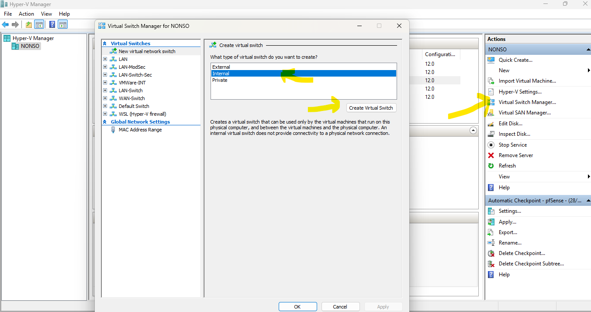

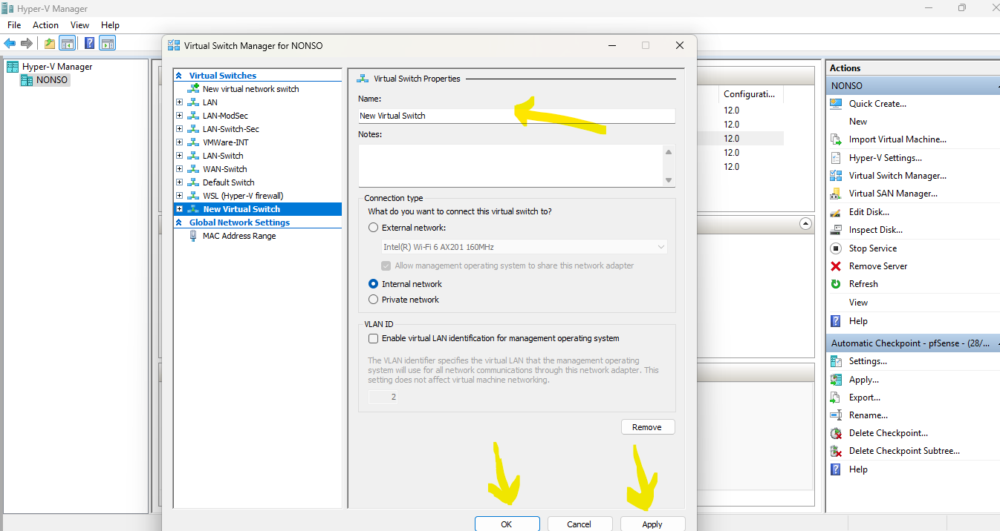

**Attach LAN1 to pfsense and Configure Networking**
- Right-click pfSense > Settings
- Under Hardware, click "Add Hardware"
- Under "Select the devices you want to add..." choose Network Adapter > Add
- Under Virtual switch, select the switch created earlier (LAN1) > Apply > Ok
- This essentially attaches this LAN interface to pfSense, which functions here as Router/Firewall
- Next, we will login to pfSense to setup Networking on this new interface

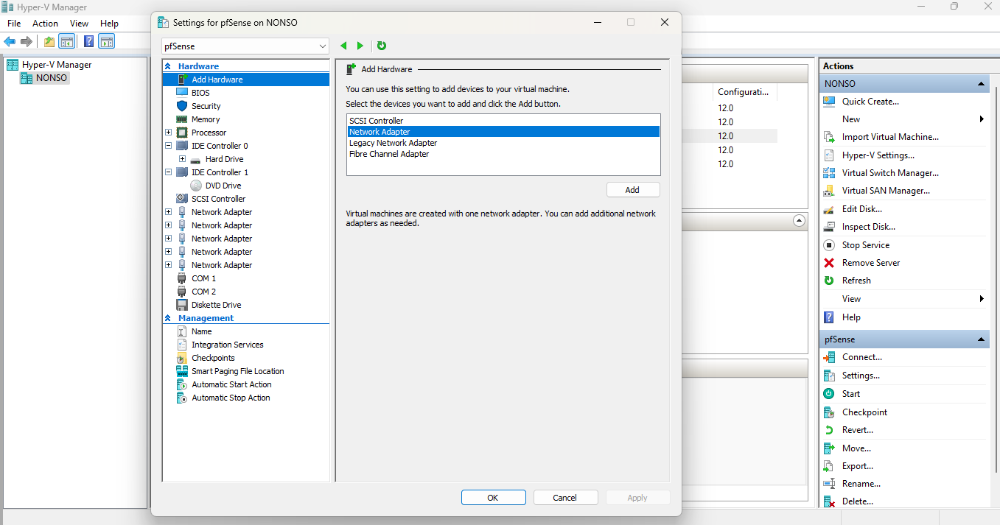

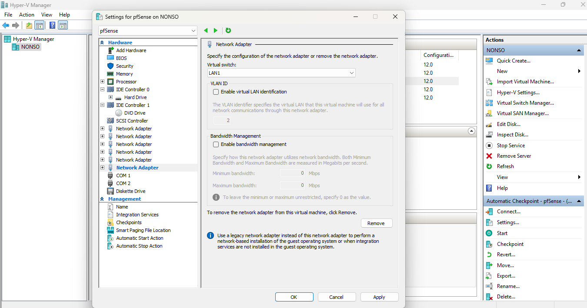

**Configure LAN1 virtual Network**
- Boot up pfSense and login to admin console
- Go to Interfaces > Assignments > Select the newly attached interface (maybe represented with a different name) > Add (this will bring you to the interface config page)
- Under General Configuration, check "Enable Interface"
- Under Description, change to desired name (eg LAN1)
- Under IPv4 Configuration type, choose Static IPv4
- Go down to Static IPv4 Configuration. IPv4 Address: 192.168.1.1 /24 (Or whatever private address range you want. IP here will be Gateway address for all systems launched under this interface)
- Go down and click Save. Come up and click Apply changes

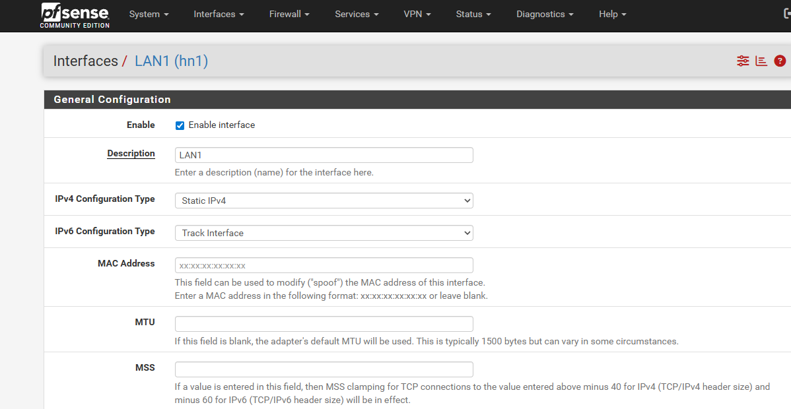

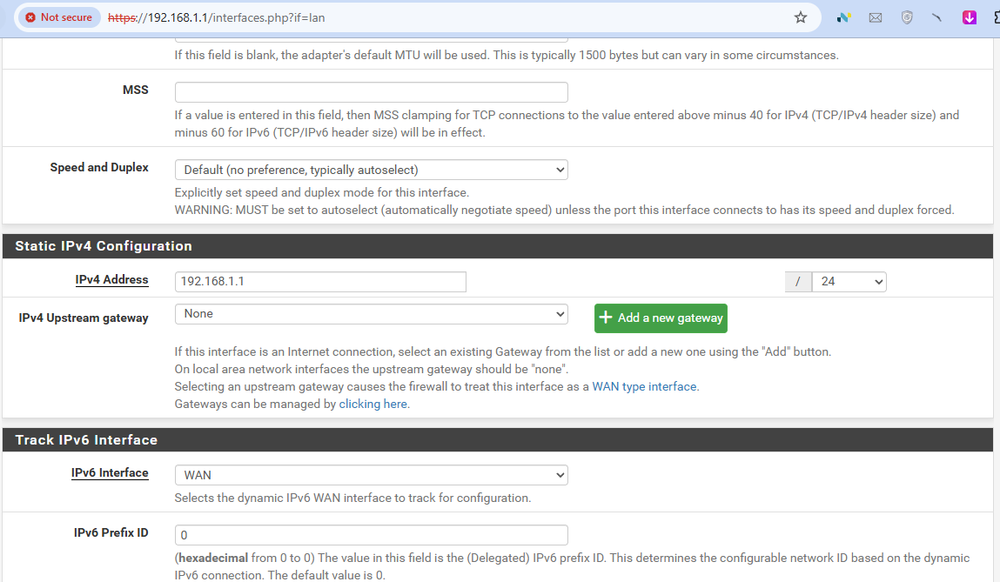

**Set Firewall Rules**
- Go to Firewall > Rules > select LAN1 > Add
- Add 2 rules
  - Source: LAN1 Subnet, Destination: Any (This allows all Systems launched on this LAN to go out internet for update and download OS installation packages)
  - Source: Address or Alias (Put your host system IP. eg 192.168.70.28), Destination: LAN1 Subnet (This ensure you can reach systems in this LAN from your host machine, through any ports enabled within the system, like RDP-3389/SSH-22)
- These 2 rules are ok for a start in order to launch the servers. We will make the rules more granular later.

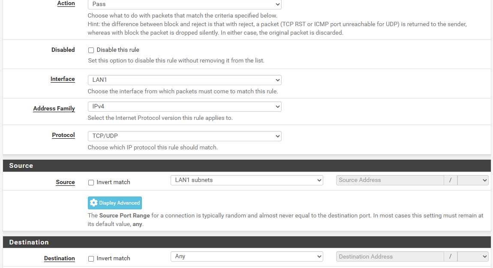

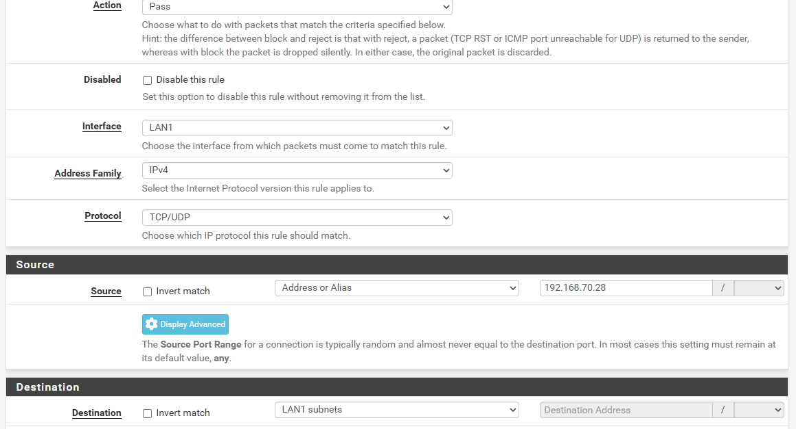

**Setup DHCP**
- It is important to enable DHCP before deploying the servers, so they can get an automatic IP to go to internet and download packages necessary for OS installation. After deploying all the servers and assigning them static IPs, you can disable DHCP on pfSense
- Go to Services > DHCP Server
- Under General Settings, check "Enable DHCP Server on LAN1 (or whatever is your interface name")
- Under Primary Address Pool
  - Subnet: 192.168.1.0/24
  - Subnet Range: 192.168.1.1 - 192.168.1.254
  - Address Pool Range: Choose a range of IPs you want your servers be assigned. It can be from 192.168.1.2 - 192.168.1.253 (any range you want. You will eventually change the assigned IP to a desired static one, so the choice here doesn't really matter. Just for initial OS installation)
- Go down and click Save. Go up and click Apply changes.

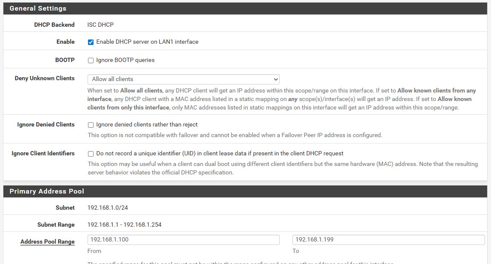

**Setup Snort in IDS/Non-Blocking Mode**
- Go to Services > Snort
- Under General Settings, check Enable Interface
- Under Interface, select LAN1
- Under Block Settings, leave Block Offenders Unchecked. We will configure this later, along with other specific configs
- Go down and click Save, Go up and click Apply Changes.
- This completes the settings necessary to deploy VMs within this vLAN

## 2. Setup Domain Controller

**Download and Install Windows Server Evaluation**
- Go to Windows Evaluation Center https://www.microsoft.com/en-us/evalcenter/evaluate-windows-server-2019 (You can choose other servers like Windows server 2022 https://www.microsoft.com/en-us/evalcenter/evaluate-windows-server-2022)
- Fill in your details and download the .iso
- Open Hyper-V Manager. Right-side under "Actions", New > Virtual Machine > next
- Under Name, give a name (like DC01) > Generation 1 > Startup memory (4096 MB can do) > Under Connection, ensure you select LAN1 you created earlier > HDD location, you can leave default > Install an OS from a bootable CD/DVD (browse to where you downloaded the Windows Evaluation .iso) > Review and Finish
- Right-click the VM (DC01) > Connect > Start (Follow the Onscreen instruction to install the server)

**Change Server Name and Static IPs**
- Login to Server with Local Administrator Password
- Go to Server manager > Local Server > Click current Computer name > Change > assign new name (eg DC01) > Restart
- After restart, Open Control Panel > Network and Sharing Center > Change Adapter Settings
- Right-click the available network adapter (ethernet) > Properties > Double-click IPv4
- Check "Use the following IP Address". IP: 192.168.1.10, Subnet mask: 255.255.255.0, Gateway: 192.168.1.1, DNS: 192.168.1.10 (or 127.0.0.1), Alt DNS: 8.8.8.8 (or 1.1.1.1) > Ok

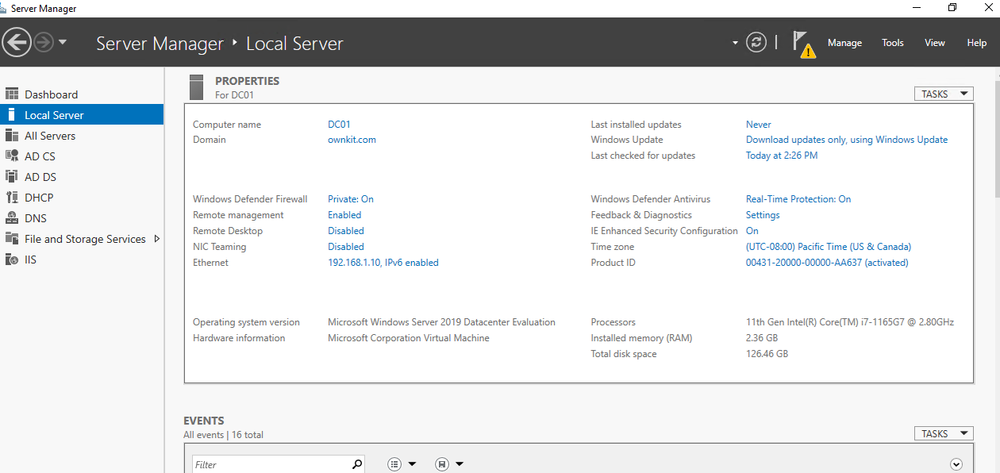

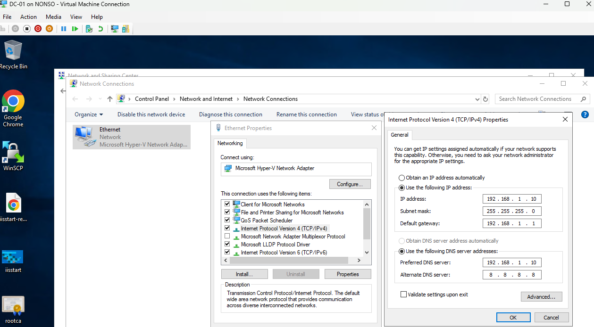

**Setup Active Directory Infrastructure**
- Open Server Manager > Manage > Add Roles and Features > Role-based or Feature-based Installation > choose DC01
- Under server roles, check Active Directory Domain Services > Add required feature (eg AD DS Tools) > Keep the rest default till Install
- After installation, go to Server Manager and click "Promote this Server to a Domain Controller"
- In Active Directory Domain Services Configuration wizard, Add a New Forest > root domain name ownkit.com > Set Forest and Domain functional level to Windows Server 2016 > Ensure Domain Name System (DNS) server is checked (to install DNS service) > Check Global Catalog (GC) > Enter a Directory Services Restore Mode (DSRM) password > Accept defaults till Install
- System will automatically reboot after installation.
- After reboot, go to Start > Windows Administrative Tools > Active Directory Users and Computers > very that ownkit.com is listed

**Create Organizational Units, User and Groups**
- Open Active Directory Users and Computers
- To create Organizational Unit, right-click ownkit.com > New > Organizational Unit
- To create group, right-click ownkit.com > New > Group
- To create users, right-click ownkit.com > New > User

- Test user login by joining a client machine to the domain and login with one of users created
- Test DNS setup
```PowerShell
 nslookup ownkit.com
 # This should resolve to 192.168.1.10
 ```

All the above setup can be done automatically using the included PowerShell script. 

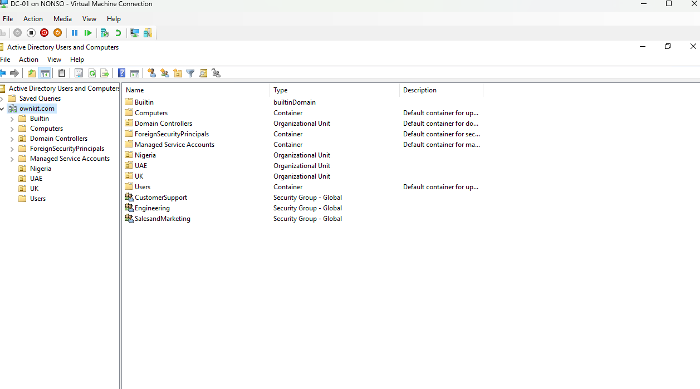

**Setup Certificate Services**
- We will set this up after setting up and joining the web server to the domain

## 3. Setup the Web Server (server01)

**Follow step 2 above to install Windows Server 2019 on LAN1, Change computer name to server01 and change IPs**
- Server01 IP: 192.168.1.11
- All other settings (Gateway, DNS, Subnet mask are the same with DC01)

**Join server01 to ownkit.com Domain**
- Open Server Manager > Domain > Change > Under member of, check Domain and input ownkit.com > Ok (computer will restart)

**Install Web Server (IIS)**
- Open Server Manager > Manage > Add Roles and Features > Role-based or feature-based installation > Choose server01 as the target server > Check Web Server (IIS) > On the Role Services page, leave defaults > Complete installation

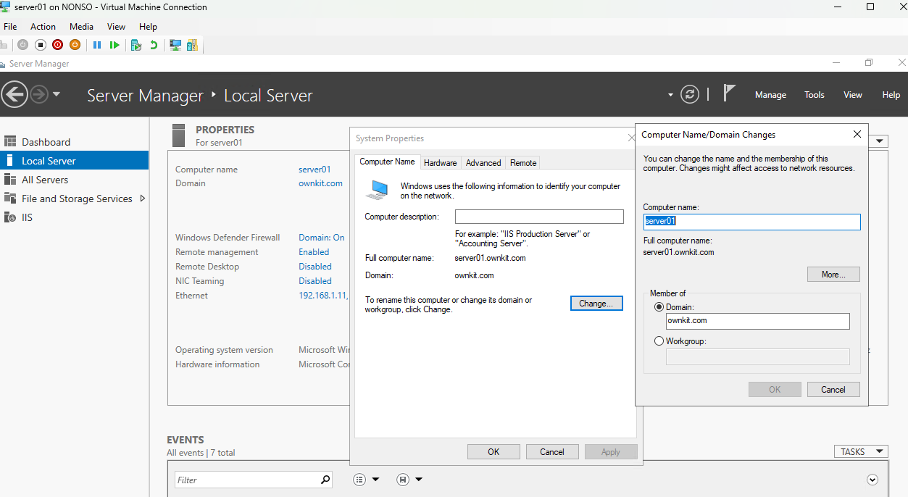

## 4. Setup Certificate Services

**Install Active Directory Certificate Services on DC01**
- Login to DC01 with account with admin priviledge
- Open Server Manager > Manage > Add Roles and Features > Select Role-based or feature-based installation > Choose DC01 as the target server > Check Active Directory Certificate Services > On the Role Services page, select Certification Authority > Leave the rest default and complete

**Configure Certificate Authority**
- Open Server Manager > click the yellow triangle and select Configure Active Directory Certificate Services > Check Certification Authority > Enterprise CA > Choose Root CA > Select Create a new private key > Accept defaults for cryptography > Set the CA Name (eg ownkit-DC01-CA) > Set the validity period (eg 5 years) > Accept defaults for the rest till complete.
- Open Certificate Authority to verify installation

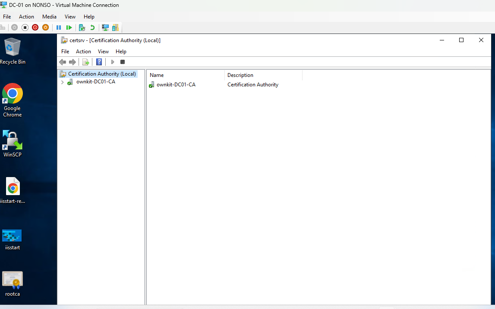

**Configure Certificate Template and Publish the Root CA**
- In Certification Authority, right-click Certificate Templates > Manage > Find the Web Server template > right-click > Duplicate Template
- In the new template, General tab: Name it DC01-New-Cert, set validity to 2yrs
- Subject Name tab: Select Supply in the request (allows specifying the subject name during request)
- Security tab: Add Domain Computers group and ensure it has Enroll and Autoenroll permissions
- Click Ok to save it
- Back in Certification Authority, right-click Certificate Templates > New > Certificate Template to Issue
- Select DC01-New-Cert > Ok

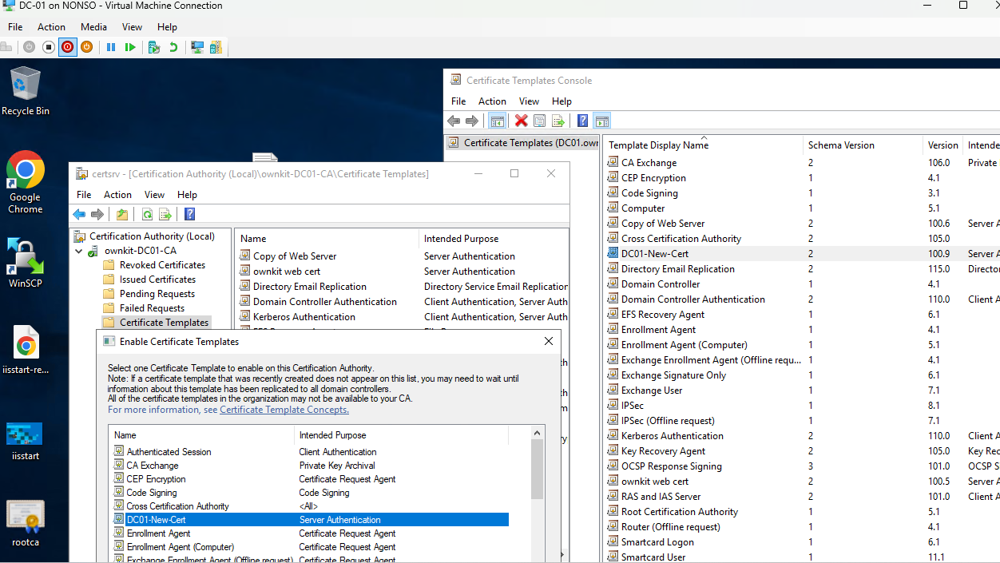

**Publish the CA's Root Certificate**
- Open Certification Authority > right-click ownkit-DC01-CA > select Properties
- On the General tab, click View Certificate > Details > Copy to File
- Export the root certificate as a .cer file (e.g., ownkit-DC01-CA.cer) using DER encoded binary X.509
- Save it and export it to server01

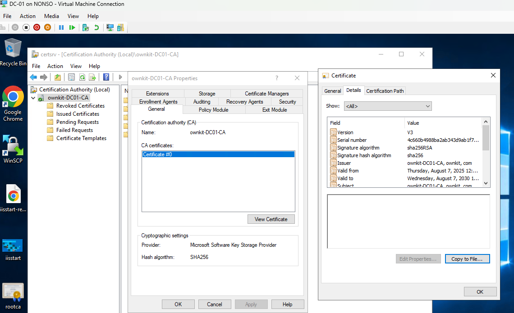

**Import the Root CA to server01**
- On server01, run mmc > File > Add/Remove Snap-in > Add Certificates (Computer account) > Local computer > Ok
- Under Certificates (Local Computer), Navigate to Trusted Root Certification Authorities > Certificates > right-click > All Tasks > Import (import the ownkit-DC01-CA.cer file where you saved it)

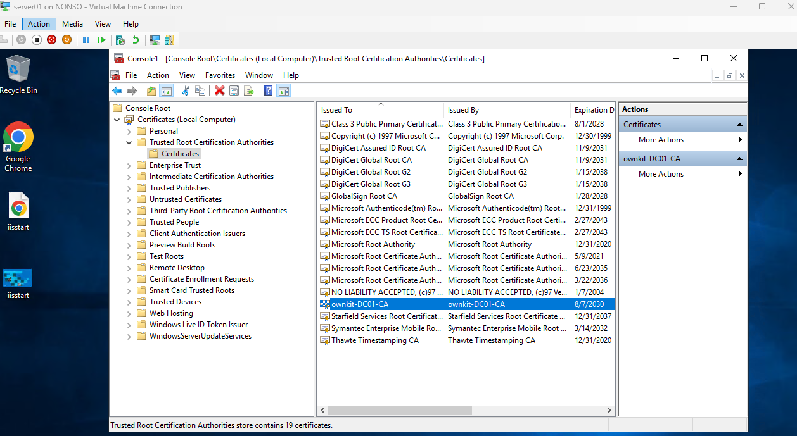

**Request a Certificate**
- On server01, open IIS Manager > Select the server node (server01) > double-click Server Certificates > Create Certificate Request in the right pane
- Fill the following info;
  - Common Name: www.ownkit.com
  - Organization: ownkit
  - Organizational Unit: IT
  - City/Locality, State, Country: eg Dubai
  - Cryptographic provider: Select Microsoft RSA SChannel Cryptographic Provider
  - Bit length: Select 2048
- Save the request to a file eg request.txt

**Submit the Request to DC01**
- On Dc01, open command prompt and run;
```PowerShell
 certreq -submit -attrib "CertificateTemplate:WebServerCustom" C:\path\to\request.txt C:\signed.cer
 # Replace C:\path\to with path where you placed request.txt
 ```
- Copy signed.cer to server01

**Install the signed certificate on server01**
- On server01, In IIS Manager, under Server Certificates, click Complete Certificate Request
- Browse to signed.cer > set a Friendly name (eg www.ownkit.com), and select Web Hosting as the certificate store
- Click Ok to install the certificate

**Bind the Certificate to IIS Web Server**
- Still on IIS Manager, Navigate to Sites > Default Web Site
- Right-click Default Web Site > Edit Bindings > Select the https binding (port 443) and click Edit
- Select SSL certificate: Choose www.ownkit.com (the friendly name of the certificate) > click Ok and close
- Restart IIS with command;
```PowerShell
iisreset
```

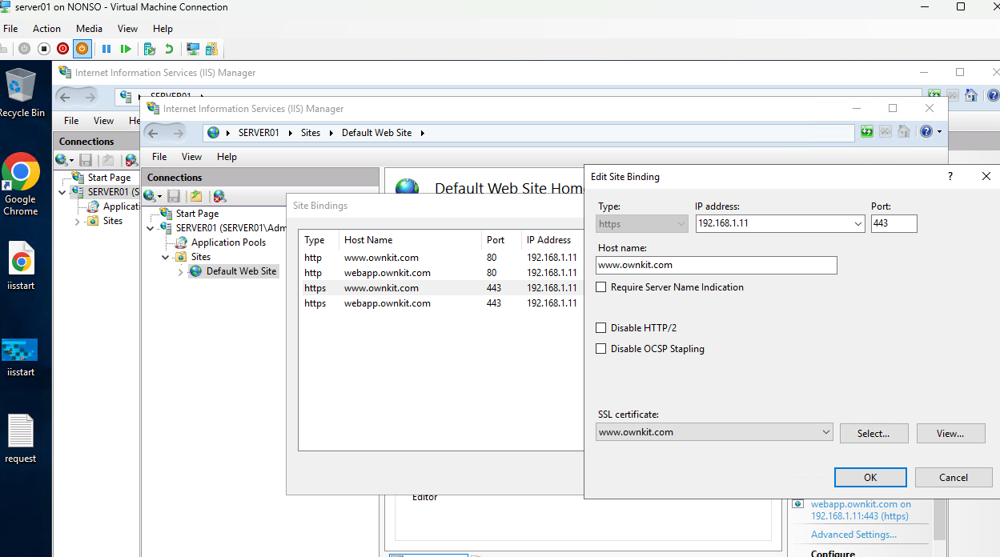

**Set A records for the web server on DC01**
- On DC01 go to DNS > DC01 > Forward Lookup Zone > oenkit.com > right-click > New Host (A or AAA)
- Name: www, IP: 192.168.1.11
- Do the same for webapp
- We will change these DNS settings latter when we setup the Apache/ModSecurity reverse proxy. For now, this is for testing purposes

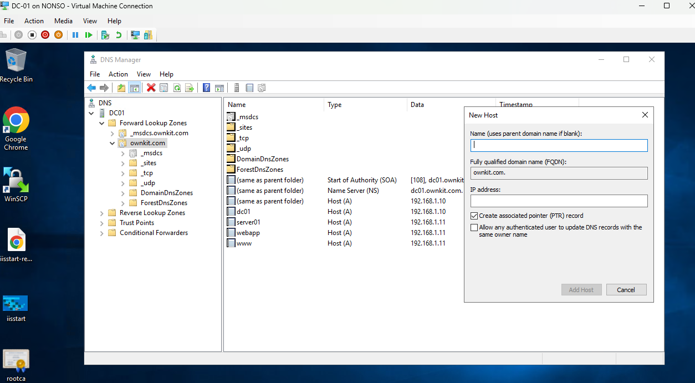

**To Deploy this test application on your Windows Web Server;**
- Install git
```PowerShell
# Clone this repo
cd $env:USERPROFILE
git clone https://github.com/nonso-chiagunye/ownkit-lab.git 

# Remove all files from wwwroot
Remove-Item -Path "C:\inetpub\wwwroot\*" -Recurse -Force

# Copy the application files into wwwroot
Copy-Item -Path "$env:USERPROFILE\ownkit-lab\LAN1-DC-IIS\ownkit-bank\*" -Destination "C:\inetpub\wwwroot\" -Recurse -Force
```

**Login with these username and PIN combinations;**
- nc:1111
- km:2222
- ag:3333
- ar:4444
