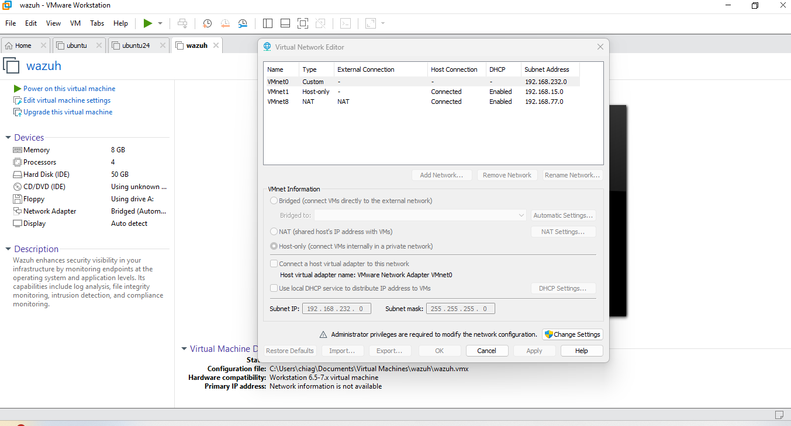
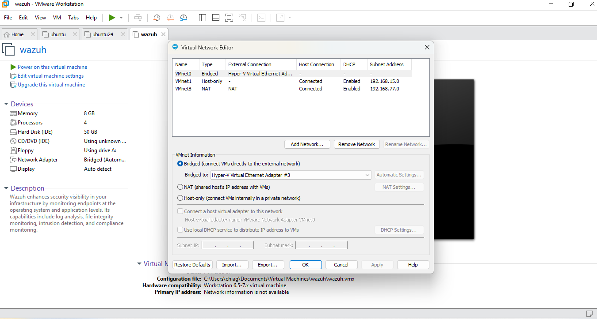

# Create LAN3 v-Switch on Hyper-V, Create a Custom Network Bridge between VMware and LAN3, Install and Configure Wazuh

## Create LAN3 on Hyper-V and Configure the Networking on pfSense

- Click [here](../LAN1-DC-IIS/README.md) on steps to create internal v-Switch on Hyper-V and configure on pfSense (Name the switch LAN3, assign IP 192.168.2.0/24)

## Create a custom bridge between LAN3 and VMware

- Open VMware Workstation > Edit > Virtual Network Editor
- On Virtual Network Editor click Change Settings
- Click on the VMware network that corresponds with Bridged connection (likely VMnet0)
- Under Bridged > Bridged to: Select the Hyper-V Virtual Ethernet Adapter that corresponds with LAN3 v-Switch
- Click Apply > Ok





## Download and install Wazuh on VMware using the Bridged Network
- Visit [here](https://documentation.wazuh.com/current/deployment-options/virtual-machine/virtual-machine.html) to download Wazuh OVA 
- Go to where the file is downloaded > Right-click > Open with > Choose VMware Workstation
- Change the name and storage path > Import (This will import the virtual machine)
- Right-Click on the newly imported virtual machine > Settings.
- Under Network Adapter, ensure it is on Bridged > Ok
- Start the Virtual Machine by clicking the play icon to load
- When prompted, Username: wazuh-user, Password: wazuh

**Modify the Network Details of Wazuh**
- The the network details from the ones automatically applied by DHCP running on pfSense to static IPs
```bash
sudo ip addr add 192.168.2.10/24 dev eth0
sudo ip route add default via 192.168.2.1 dev eth0
# Modify DNS
sudo vi /etc/resolv.conf
# Press i to enter edit mode
# Add the following;
#nameserver 192.168.2.10    (This is the Domain Controller/DNS Server)
#nameserver 8.8.8.8
# Press Esc to exit edit mode
# Press :wq! to save and exit vim
sudo systemctl restart NetworkManager  # Restart Network Manager
```
- Access Wazuh dashboard at https://192.168.2.10
- Login with admin:admin

### Import Logs from All the Hosts to Wazuh
- You can install Wazuh agent on DC01, Server01 (Windows) and Rocky Linux (RPM)
- pfSense is FreeBSD, so we will export the logs via syslog (as you can't install Wazuh agent on it)

**Install Wazuh Agent on DC01, Server01 and Rocky Linux**
- On Wazuh Dashboard, under Endpoints, click Deploy New Agent.
- For DC01 and Server01, choose Windows > Optionally Add Agent name > Copy the generated commands and run on the different servers
- For Rocky Linux, Choose RPM amd64 > Optionally Add Agent name > Copy the generated commands and run on the Rocky Linux Server

**Export pfSense Logs to Wazuh**
- Visit pfSense Dashboard on https://192.168.1.1
- If you haven't changed the password, use admin:pfsense to login
- Go to Status > System Logs > Settings
- Under General Logging Options, Log Message Format: syslog
- Under Remote Logging Options, check "Send log messages to remote syslog server", Source Address: LAN3, IP Protocol: IPv4, Remote Log Server: 192.168.2.10:514, Remote Syslog Contents: Check the logs you want to send (ensure to include System Events and Firewall Events),
- Go down and click Save, and Apply

**Configure Wazuh to Receive Logs from pfSense**
- Go to Wazuh Manager, and edit the ossec.conf
```bash
sudo nano /var/ossec/etc/ossec.conf
```
- Include the following remote block
```xml
<remote>
  <connection>syslog</connection>
  <port>514</port>
  <protocol>udp</protocol>
  <allowed-ips>192.168.2.1</allowed-ips>
</remote>
```
- Restart Wazuh Manager
```bash
sudo systemctl restart wazuh-manager
```


