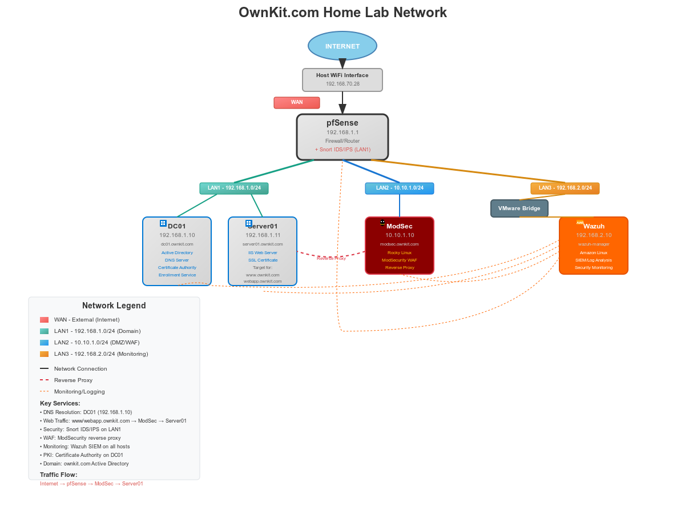
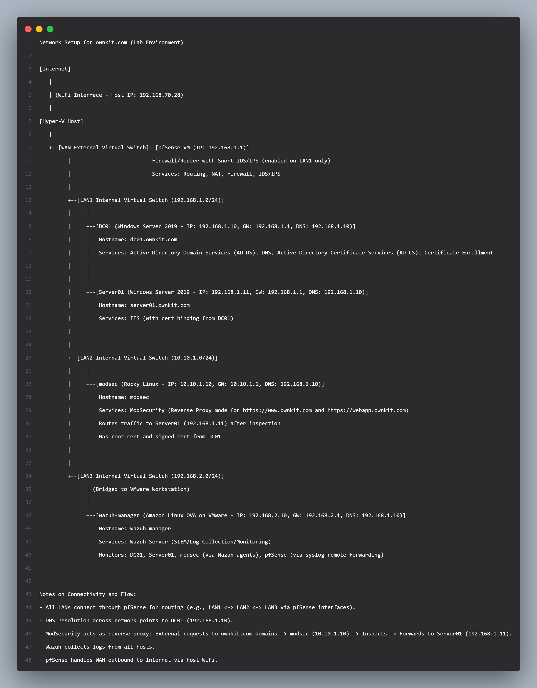

## Overview

Ownkit.com is a home lab infrastructure that simulates a secure enterprise network. It is meant to demonstrate the use of open-source tools, combined with secure by design architecture to secure workloads. 

### Tools Used

- Host: Windows 11 Laptop
- Hypervisors:
  - Hyper-V Desktop
  - VMWare Workstation Pro
- Firewall/Router: pfSense
- Switches: Hyper-V Virtual Switch
- IPS/IDS: snort
- Access Control: microsoft Active Directory
- Domain Controller, DNS and Certificate Server: Windows Server 2019 (Evaluation)
- Web Server: Windows Server 2019
- WAF: ModSecurity with OWASP Corerulesets
- WAF vHost: Rocky Linux 9.6
- SIEM: Wazuh

### Architecture Highlight

The network is comprised of one WAN vSwitch and three LAN vSwitches built with Hyper-V, labelled as follows;

- **WAN** - This is an external virtual switch attached to the host WiFi interface, with IP 192.168.70.28. The network uses this to go out to the internet
- **LAN1** - This is an internal virtual switch. IP: 192.168.1.0/24
- **LAN2** - This is an internal virtual switch. IP: 10.10.1.0/24
- **LAN3** - This is an internal virtual switch. IP: 192.168.2.0/24

## pfSense - WAN
- This is the router and firewall.
- All the virtual switches are attached to its VM
- From outside the network (host), it is accessed on 192.168.1.1. Whereas, it is accessed from within each LAN using their gateway address.

## LAN1
- CIDR: 192.168.1.0/24
- Interface is attached to 2 Windows Server 2019 (DC01 and Server01)
- On pfSense, snort is enabled on this interface for IDS/IPS.      

**DC01**:
  - Hostname: DC01
  - FQDN: dc01.ownkit.com
  - IP: 192.168.1.10
  - Gateway: 192.168.1.1
  - DNS: 192.168.1.10
  - Services: Active Directory Domain Services, Active Directory Certificate Services, DNS, Certificate Enrollment Service.   

**Server01**:
  - Hostname: server01
  - IP: 192.168.1.11
  - Gateway: 192.168.1.1
  - DNS: 192.168.1.10
  - Services: IIS

## LAN2
- CIDR: 10.10.1.0/24
- This LAN environment functions as the DMZ for the web traffic
- Runs only one VM - Rocky Linux v9.6.       

**Rocky Linux**:
  - Hostname: modsec
  - IP: 10.10.1.10
  - Gateway: 10.10.1.1
  - DNS: 192.168.1.10
  - Services: ModSecurity (WAF) with OWASP Coreruleset, Apache2 (httpd)
  - Notes: ModSecurity is deployed in reverse proxy mode, intercepting http/https traffic for inspection before forwarding to IIS server (192.168.1.11)

## LAN3
- CIDR: 192.168.2.0/24
- This is the monitoring interface, running SIEM solution
- The interface is bridged to VMWare vNetwork Adapter, allowing a connection between Hyper-V and VMWare, managed by pfSense on this interface.

**VMWare Desktop Pro and Wazuh**:
  - This interface, through VMWare, runs a single VM node of Wazuh SIEM, deployed using .ova disk of Amazon Linux
  - IP: 192.168.2.10
  - Gateway: 192.168.2.1
  - DNS: 192.168.1.10
  - Services: Wazuh SIEM

### Deployment Steps and Details

Details of entire network deployment is found below;
- [WAN-pfSense-snort Setup](WAN-pfSense-snort/README.md)
- [LAN1 Infrastructure Setup](LAN1-DC-IIS/README.md)
- [LAN2 and ModSecurity Setup](LAN2-ModSec/README.md)
- [LAN3 and Wazuh Setup](LAN3-Wazuh/README.md)
