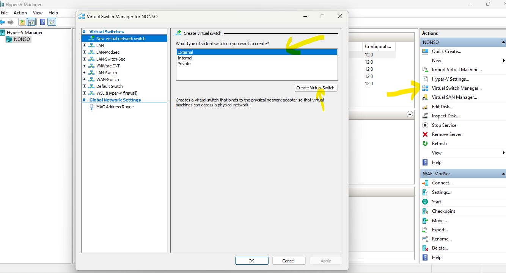
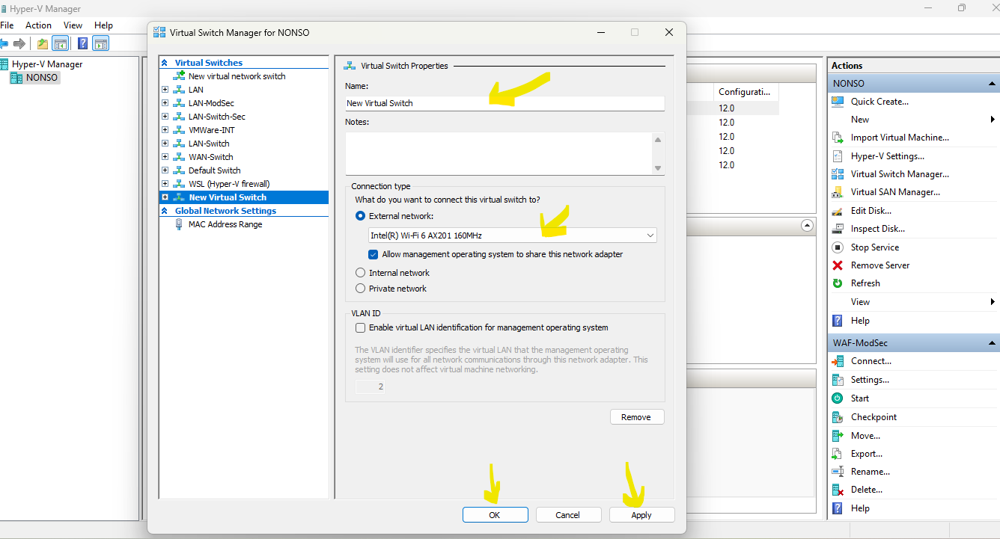
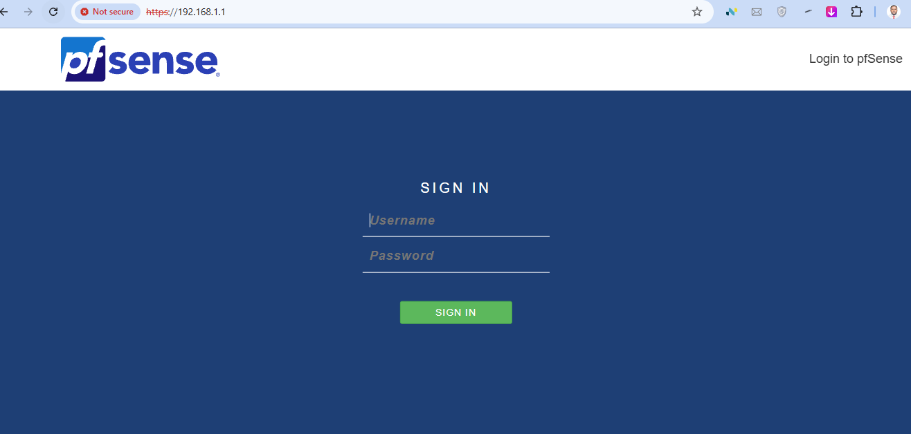
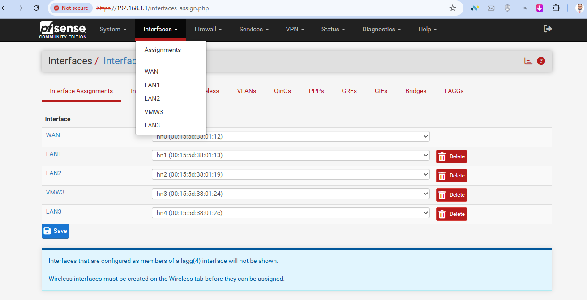
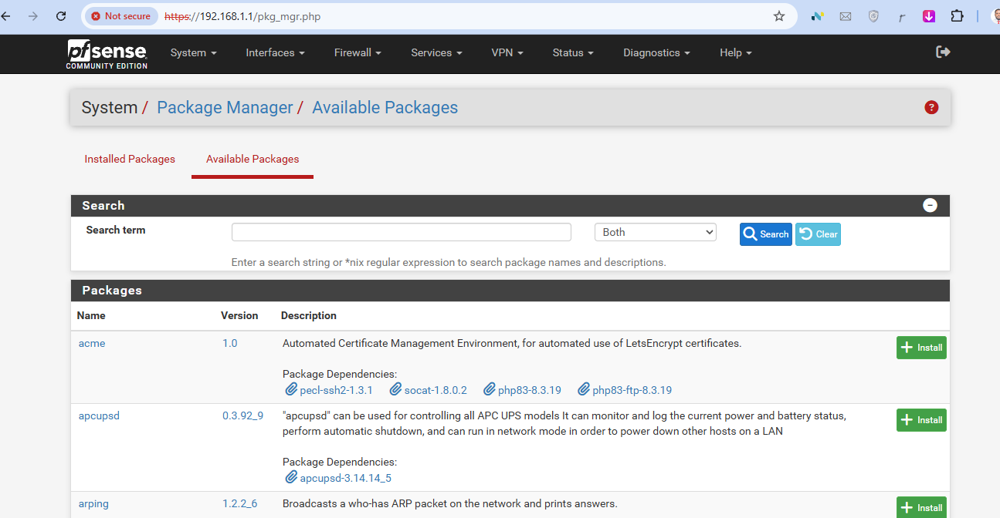
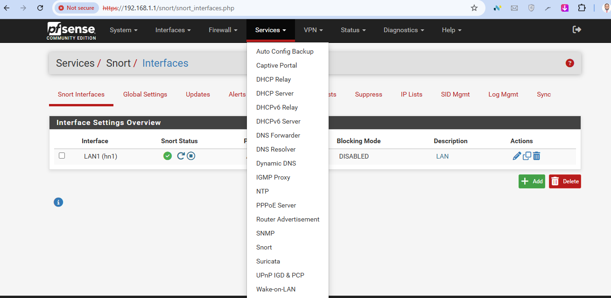

# Steps to Setup WAN vSwitch, pfSense, and Snort

## 1. Setup WAN 

- WAN switch here is Hyper-V external virtual switch, bound to host network interface - either Ethernet or WiFi (In this case, I used WiFi, but Ethernet Interface will also work if you use it more predominantly).

**Setup Steps**
- Open Hyper-V Manager
- At the right-hand conner, under Actions, click Virtual Switch Manager
- Under "What type of virtual switch do you want to create?" choose External > Create Virtual Switch
- Choose a name, eg WAN
- Under External Network: choose the network you want to bind to - Ethernet or WiFi
- Click Apply > Ok






```python

```

## 2. Setup pfSense

**Download and Unzip**
- Visit netgate to download the .iso installer https://www.pfsense.org/download/
- You will download a zipped file netgate-installer-amd64.iso.gz.
- Unzip with **$ gunzip netgate-installer-amd64.iso.gz**

**Install on VM**
- Open Hyper-V Manager
- Right-side under "Actions", click New > Virtual Machine
- Follow the installer and choose Name (eg pfSense) > Generation 1 (to ensure compartiblity) > Startup Memory (up to 4Gb is ideal) > Connection (select the WAN vSwitch created earlier) > HDD (you can leave default name and location) > Install an Operating system from a bootable CD/DVD-ROM > Image (browse to the location of your Netgate pfSense installer .iso and select it) > Finish. This will make the new VM appear under Virtual Machines
- Right-click the VN (pfSense) > Connect > Start (follow the on-screen installation instructions till it is installed)
- Open a browser and login on https://192.168.1.1. admin:pfsense
- Ensure to change the password after first login



**Rename and Configure WAN Interface**
- Click Interfaces > Assignments (The interface will likely appear with another name, like hn0)
- Click on the New Interface > Under Description, change the name as desired (eg WAN)
- Scroll to the end and click Save. Come to the top and click Apply Changes



## 3. Setup Snort

- Snort is an Open-source IPS/IDS solution
- It is part of many packages you can run within pfSense

**Snort Setup Steps**
- On pfSense, go to System > Package Manager > Available Packages > Scroll to where snort is and click Install



- After installation, snort should appear under Services
- We will set it up and enable it on LAN1 interface later


